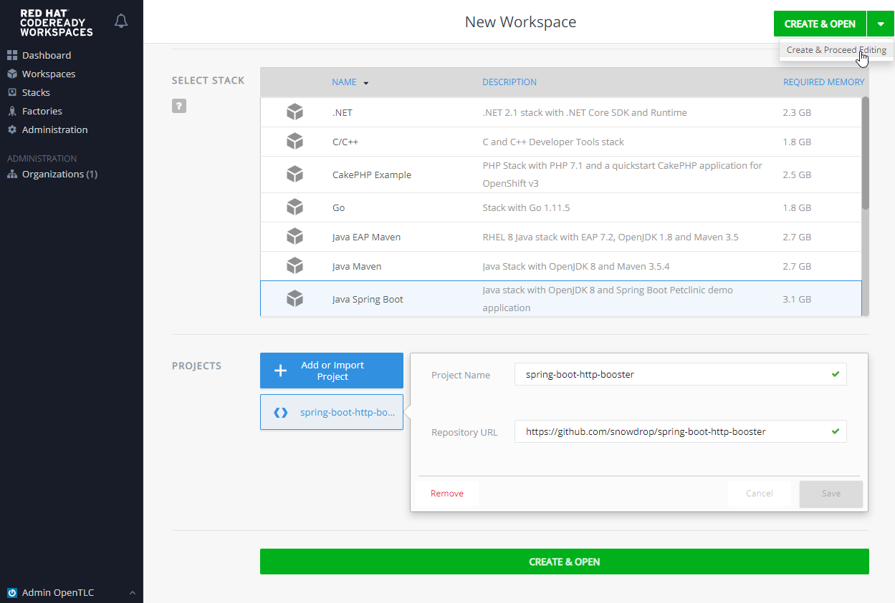
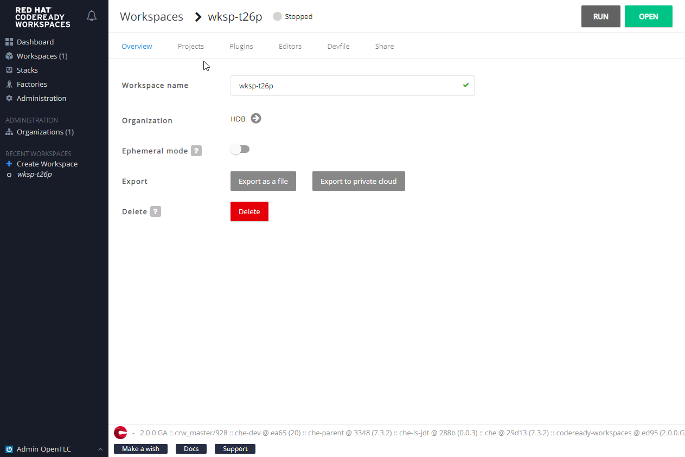
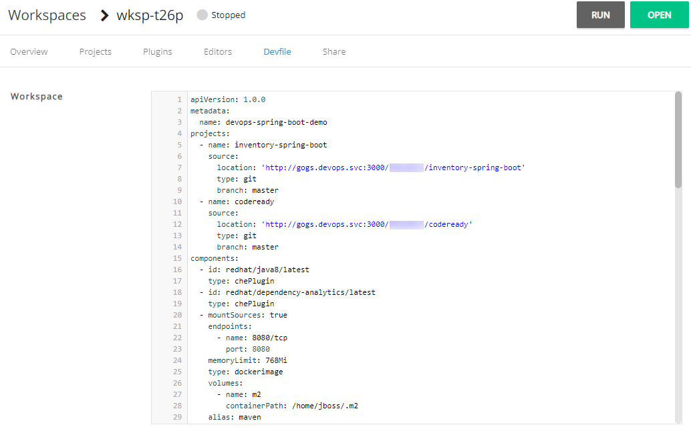
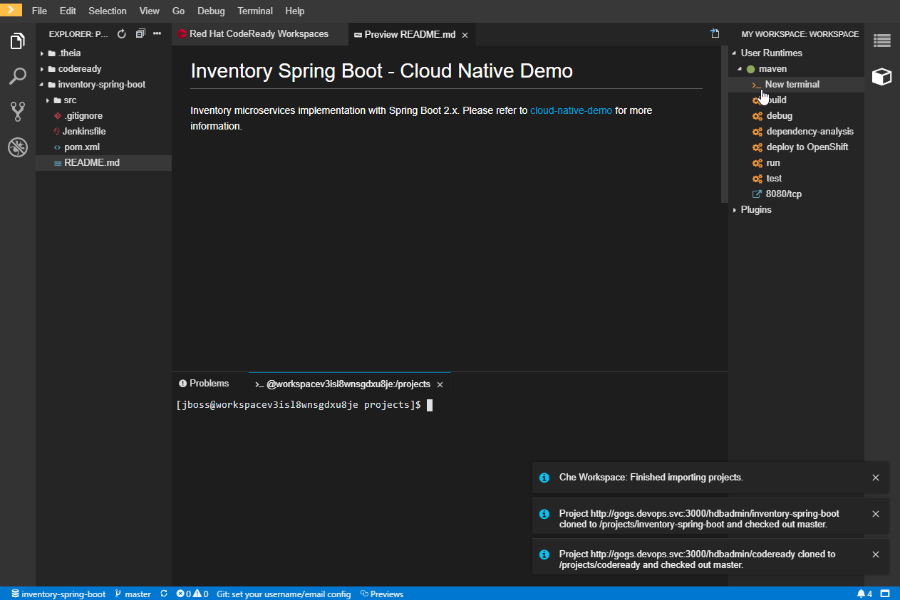

# Explore CodeReady Workspaces

<!-- TOC -->

- [Developer Workspace](#developer-workspace)
- [OpenShift CLI Login](#openshift-cli-login)

<!-- /TOC -->

## Developer Workspace
You will need to login and create an account in CodeReady Workspaces before you can create a new workspace.

```
Please request Administrator to add you in the Organization after account creation.
```

After you have login, you can create a new Workspace:



Select Java Spring Boot, and select Create & Proceed Editing from the Dropdown menu. 



Click Devfile Tab and replace the content from Git Project/devfile.yaml in the [Appendix: Environment Info](devops-env-info.md):



You can also change the name: to your own preference. Click Open to open the workspace
and wait for it to start. This will add 2 projects in the workspace after creating:

- inventory-spring-boot
- codeready

After the workspace started, open a terminal from the right menu > _New terminal



From the command prompt, copy the Maven settings.xml file to ensure the correct Nexus mirror URL:
```bash
cp codeready/settings.xml /home/jboss/.m2
```

## OpenShift CLI Login
You can use the terminal on your workstation for running the OpenShift CLI commands, provided you download the OpenShift 
CLI and add it to your path.

Enter Y to use a potentially insecure connection. The reason you received this message is because we are using a 
self-signed certificate for this workshop, but we did not provide you with the CA certificate that was generated by OpenShift. 
In a real-world scenario, either OpenShift certificate would be signed by a standard CA (eg: Thawte, Verisign, StartSSL, etc.) 
or signed by a corporate-standard CA that you already have installed on your system.

```bash
oc login https://api.<cluster url>:6443
```

Once you issue the ```oc login``` command, you will be prompted for the username and password combination for your user 
account. 

- Username: \<userid - htpasswd userid/LDAP ID\>
- Password: \<password - htpasswd/LDAP password\>

Please refer to [Appendix: Environment Info](devops-env-info.md) for the Master URL.


Projects are a top level concept to help you organize your deployments. An OpenShift project allows a community of users 
(or a user) to organize and manage their content in isolation from other communities. Each project has its own resources, 
policies (who can or cannot perform actions), and constraints (quotas and limits on resources, etc). Projects act as a 
"wrapper" around all the application services and endpoints you (or your teams) are using for your work. You can see the 
list of projects you have access to using the following command:

```bash
oc get projects
```

Now you can create a project:

Replace XX with the number provided to you by the instructor.

```bash
oc new-project java-XX
```

When using OpenShift CLI, you can specify in which project the command should be executed using the -n switch. If not 
specified, OpenShift will run the command in the active project. You can switch between active projects using the oc 
project command:

Replace XX with the number provided to you by the instructor.
$ oc project java-XX

Now using project "java-XX" on server "\<MASTER URL\>".

To delete the project:
```bash
oc delete project java-xx
```

[Previous](devops-explore.md) | [Top](README.md) | [Next](devops-s2i-java.md)
