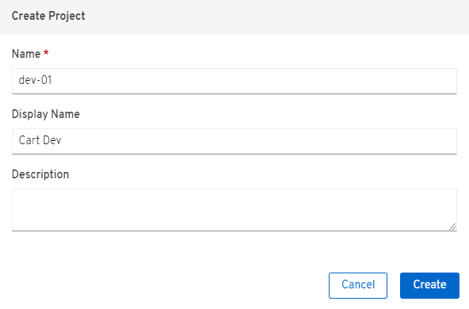
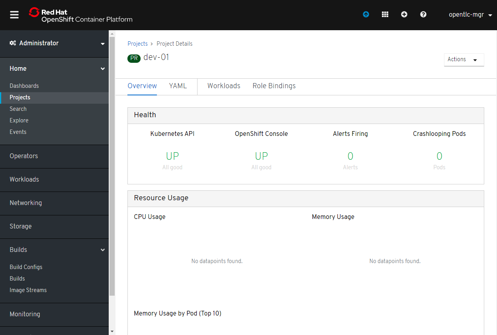
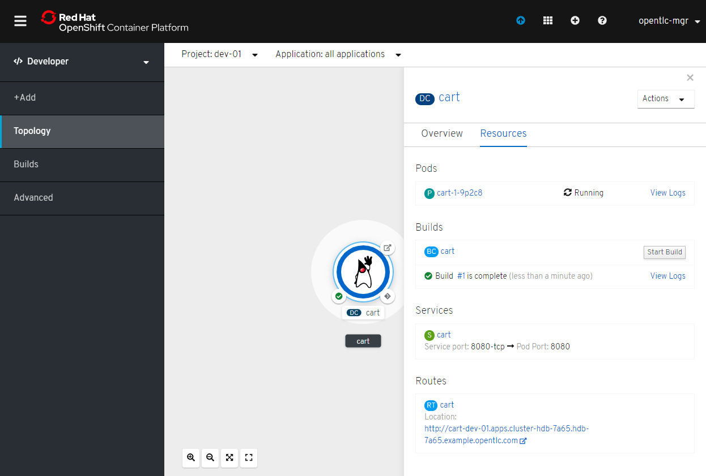
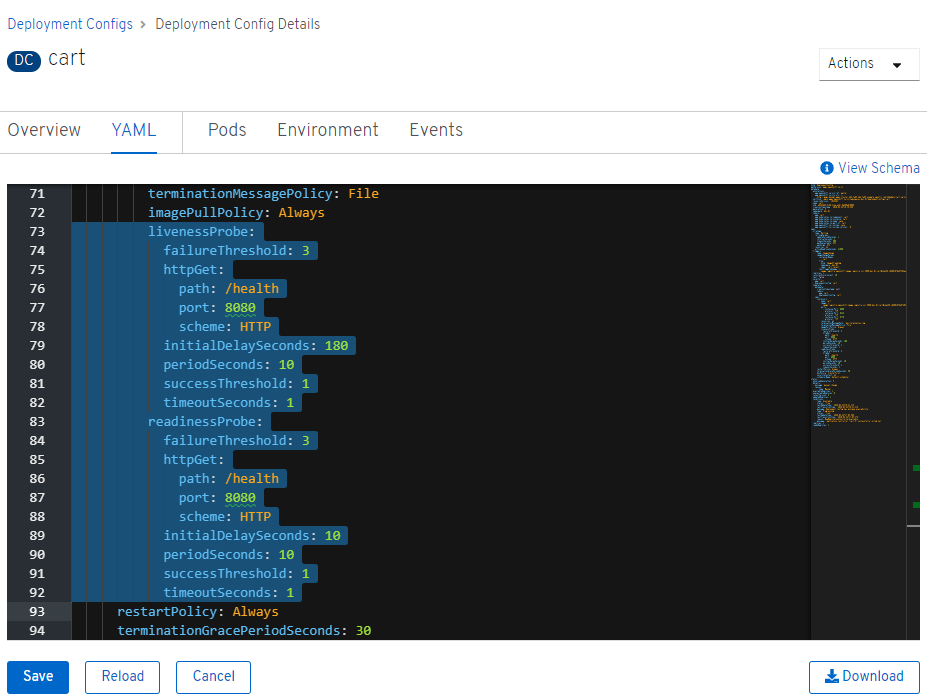

# Deployment Environments

<!-- TOC -->

- [Background](#background)
- [Create Project via OpenShift Web Console](#create-project-via-openshift-web-console)

<!-- /TOC -->

In this lab you will learn about deployment environments in software delivery lifecycle and deploy the application into 
these deployment environments.

## Background
A deployment environment describes a distinct space for an application to run during a particular stage of a CI/CD 
pipeline. Typical environments include development, test, stage, and production, for example. In this lab you will 
create Dev and Prod deployment environments for the CoolStore application which is deployed throughout this session:

- __Dev Environment__: this environment is used during development of the Cart service and every change made by 
developers gets deployed into this environment. Other services e.g. Cart and Inventory would have also their own 
dedicated Dev environments which allows the developers to write code and test their service without disrupting other 
teams. If the changes made pass the automated tests, the code will be deployed into the Prod environment.
- __Production Environment__: the live environment for the entire CoolStore webshop with all services deployed and 
serving requests to customers. Any interruption in this environment would directly affect the customers.

A Project in OpenShift is a mechanism to scope applications in a cluster and is the central vehicle by which access to 
resources is managed. A project allows users to organize and manage their applications in isolation from other users. 
Users must be given access to projects by administrators, or if allowed to create projects, automatically have access 
to their own projects. Granular access control and network traffic policies for projects in OpenShift makes them a 
suitable way for modeling deployment environments that fulfil the collaboration, networking and isolation requirements.

In this lab, you will create the Dev deployment environment and deploy the Cart service into this environment. Cart 
service is developed in Java using the Spring Boot framework.

In the current lab, in order for you to become familiar with both the OpenShift Web Console and the OpenShift command 
line interface (CLI), every step is explained via both the Web Console and CLI which you can choose based on your 
preferences. Either way leads to the exact same result. Let’s start with with creating the Dev deployment environment 
and deploying the Cart service.

## Create Project via OpenShift Web Console
In OpenShift Web Console, click on the Create Project button in order to create a new project, enter the following 
details and click on Create button:

```
Replace XX with the number provided to you by the instructor.
```

- Name: dev-XX
- Display Name: Cart Dev



The Dev deployment project for the Cart service is created now and is ready for the Cart service to be deployed.



By default, the current user who created the project is the admin for this project. The OpenShift cluster admins or the 
project admins can define granular access control on the project and control how can view, modify or deploying 
applications in each project. This is particularly essential for example when you want developers to be able to view 
the Prod environments and get debug information without allowing them to modify the state of those environments. 

Now, let’s deploy the Spring Boot application, Cart service, into the Dev environment. OpenShift supports deploying 
containerized apps in three different ways and allows developer to pick the process that is most suitable for their 
projects:

- From application source code
- From application binary (e.g. app.jar)
- From docker images

OpenShift introduces a mechanism called Source-to-Image (S2I) which is a tool for building docker container images. 
It produces ready-to-run images by injecting application source into a container image and assembling a new image. 
The new image incorporates the application runtime base image and built source code and is ready to use with the docker 
run command. The application base runtime might be various language runtimes such as Java, Ruby, NodeJS, Python, etc or 
middleware runtimes such as Apache Tomcat, JBoss EAP, etc.

S2I can also take application binaries such as JAR, WAR or EAR files as input and build a new docker image for the 
application combined with the application runtime.

If you already have a process in-place for building docker images, OpenShift allows you to point to the ready docker 
images and deploy them as is on the platform.

In this lab, you will use the S2I mechanism for building the Cart service from source code. Since Cart service is based 
on Spring Boot, you only need the Java language runtime for running this service and therefore you will use the 
certified OpenJDK application runtime which is provided in OpenShift out-of-the-box. 

From the Administrator dropdown, click Developer. Click +Add and Select From Git.

```
Replace userXX with your gogs userid
```

- Git URL: http://gogs-devops.apps.\<cluster url\>/userXX/cart-service.git
- Builder Image: Java
- Builder Image Version: 8
- Application Name: cart
- Name: cart
- Create a route to the application: checked

Click on Build Configuration advanced options to specify the Maven repository manager URL to be used during the build 
phase:

- Name: MAVEN_MIRROR_URL
- Value: http://nexus.devops.svc:8081/repository/maven-public/

Note that the Maven repository manager URL is an internal URL and is not accessible externally. Click on Create button 
and then on Continue to the project overview..

All required resources are created in order to build and deploy the Cart service in the Dev project. OpenShift provides 
an out-of-the-box load-balancer which is automatically updated to route traffic to Cart service when the container is 
deployed and ready to receive traffic.

In the project overview, the Cart service S2I build process is running to build first the application JAR file and then 
a docker image by layering the JAR file on the OpenJDK base image.

Click Builds > cart > Builds > cart-1 > Logs to view the build status.

When the build finishes and the application docker image is created, the docker image is pushed by default to OpenShift 
internal registry and then deployed to OpenShift. Builds also support pushing the built image to other image registries 
outside OpenShift.



OpenShift uses container health checks to detect and handle or heal unhealthy containers which is not set yet on the 
deployed Cart service. OpenShift runs the following probes to manage the container and application health:

- Liveness Probe: a liveness probe checks if the container is still running. If the liveness probe fails, OpenShift 
restarts the container
- Readiness Probe: a readiness probe determines if a container is ready to service requests. If the readiness probe 
fails, OpenShift removes that container from the list of endpoints in the service load-balancer. A readiness probe can 
be used to signal the service load-balancer that even though a container is running, it should not receive any traffic.

Click on DeploymentConfig cart, and click YAML tab to add the following as shown:



```yaml
          livenessProbe:
            failureThreshold: 3
            httpGet:
              path: /health
              port: 8080
              scheme: HTTP
            initialDelaySeconds: 180
            periodSeconds: 10
            successThreshold: 1
            timeoutSeconds: 1
          readinessProbe:
            failureThreshold: 3
            httpGet:
              path: /health
              port: 8080
              scheme: HTTP
            initialDelaySeconds: 10
            periodSeconds: 10
            successThreshold: 1
            timeoutSeconds: 1
```

Click Save button. After saving click Overview Tab. If the deploymentconfig did not update the settings, from right 
Actions menu, click Start Rollout to watch the changes.

[Previous](devops-explore.md) | [Top](README.md) | [Next](devops-simple-pipeline.md)

