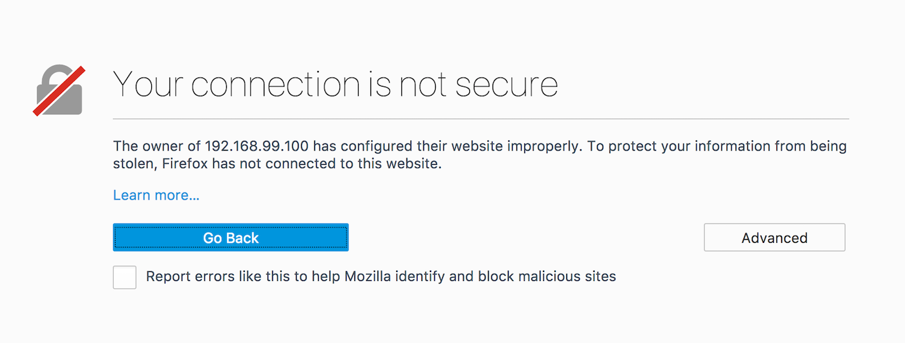
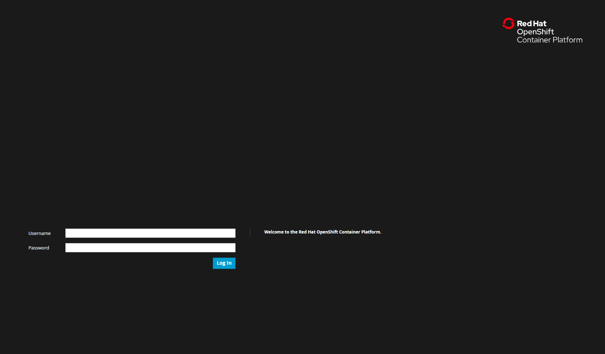
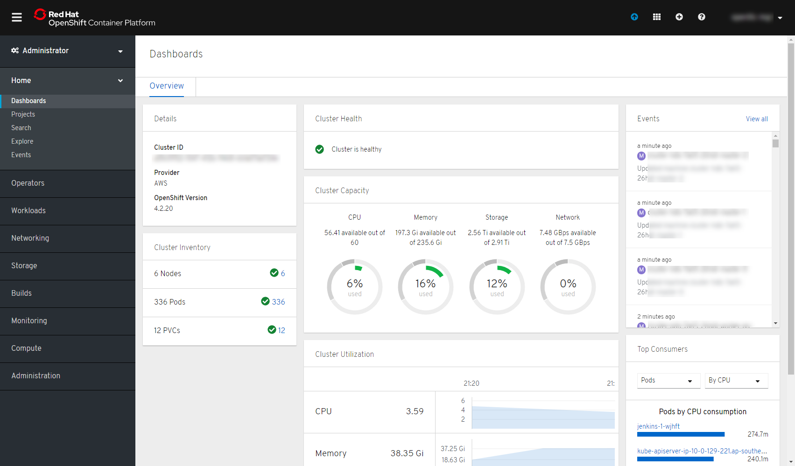

# Explore OpenShift

<!-- TOC -->

- [OpenShift Web Console](#openshift-web-console)

<!-- /TOC -->

In this lab you will get familiar with OpenShift Web Console and OpenShift CLI and gain some experience interactive with 
an OpenShift cluster.

## OpenShift Web Console
OpenShift ships with a web-based console that will allow users to perform various tasks via a browser. To get a feel for 
how the web console works, open your browser and go to the following URL: OPENSHIFT-MASTER

Since the security certificates used for securing your OpenShift cluster are self-generated and self-signed, your 
browser will not trust them by default and will show a security warning similar to the following:



In Chrome browser, click on ADVANCED and then Proceed to …​ (unsafe) to trust the certificates. In Firefox browser, 
click on Advanced button, then Add Exception…​ and then confirm trusting the certificate by click on Confirm Security 
Exception.

The first screen you will see is the authentication screen. Enter in the following credentials:

```
Replace with the userid provided to you by the instructor.
```

- Username: \<userid - htpasswd userid/LDAP ID\>
- Password: \<password - htpasswd/LDAP password\>



After you have authenticated to the web console, you will be presented with a dashboard and list of projects that your 
user has permission to work with.



[Previous](devops-intro.md) | [Top](README.md) | [Next](devops-codeready-workspaces.md)
