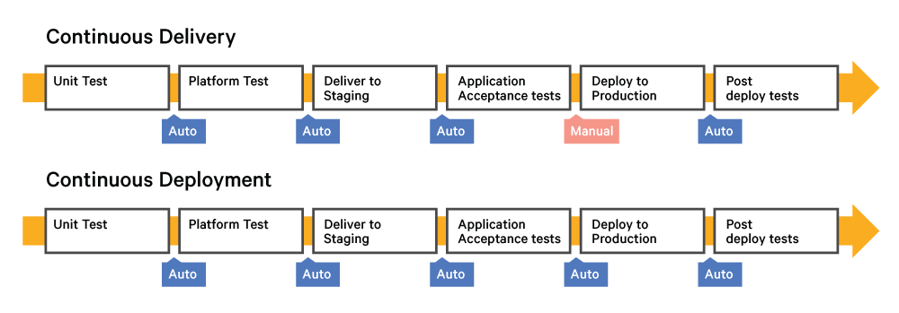
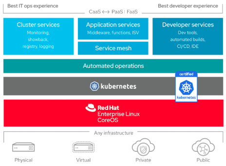
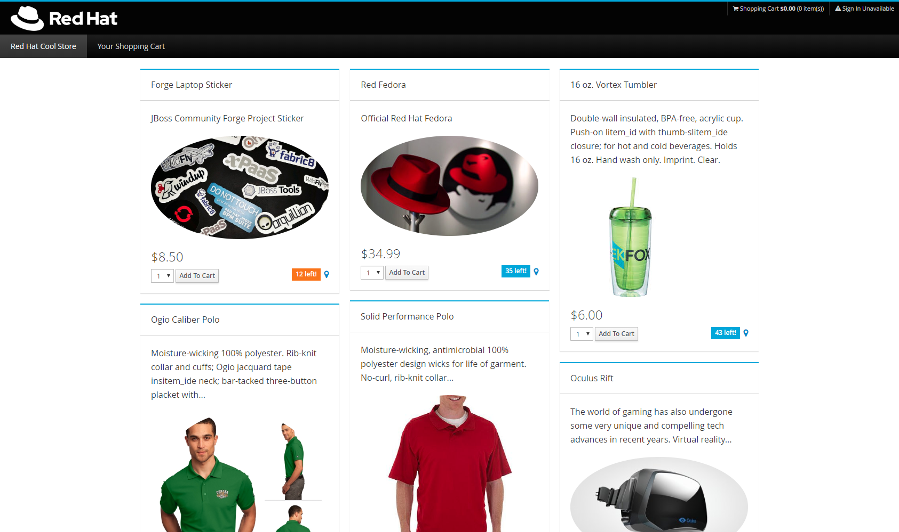

# DevOps Introduction

<!-- TOC -->

- [What is DevOps?](#what-is-devops)
- [Continuous Everything](#continuous-everything)
- [Jenkins CI Engine](#jenkins-ci-engine)
- [OpenShift Container Platform](#openshift-container-platform)
- [CoolStore Application](#coolstore-application)

<!-- /TOC -->

In this section we will give an overview of DevOps, Continuous Integration and Continuous Delivery concepts which are 
required throughout this session.

## What is DevOps?
DevOps is a combination of development and operations principles in order to create a culture that emphasize 
communication, collaboration, and cohesion between the traditionally separate developer and IT operations teams. Rather 
than seeing these as two distinct groups who are responsible for their specific tasks but don’t really work together, 
the DevOps methodology recognizes the interdependence of the two groups. By integrating these functions as one team or 
department, DevOps helps an organization deploy software more frequently, while maintaining service stability and 
gaining the speed necessary for more innovation.

In a DevOps environment, cross-functionality, shared responsibilities, and trust are all promoted.

## Continuous Everything
DevOps essentially extends the continuous development goals of the Agile movement to continuous integration and 
continuous delivery. Continuous Integration is the practice of constantly merging development work with a main line of 
code (e.g. master branch) so that changes can be tested and make sure they work with all other changes. The goal is to 
test the code as often as possible in order catch issues early in the development phase. In the continuous integration 
process, automated tests such as unit tests play an important role and are essential for a functioning continuous 
integration process. Continuous Delivery is the natural extension of Continuous Integration, an approach in which teams 
ensure that every change to the system is releasable, anWd release any version with the push of a button. Continuous 
Delivery aims to make releases simple so that we can deliver as frequently as needed and get rapid feedback on what 
customers care about.

Continuous Deployment is the most advanced evolution of continuous delivery and advocates automatic release of every 
change into production without human intervention after it has been successfully tested and verified in the process. 
Although interesting, few organization are ready today to automatically deploy changed to production. Nevertheless, 
Continuous Deployment should be a goal for every team to build sufficient trust in the process to be able to 
automatically deploy a class of changes into production.

## Jenkins CI Engine
Jenkins is a self-contained, extensible, open source automation server which can be used to automate all sorts of tasks 
such as building, testing, and deploying software. Although Jenkins was first popular as a continuous integration 
engine, its usage domain soon expanded to other areas such as Continuous Delivery pipelines due to its sheer popularity. 
Jenkins enjoys a very active community which has built out hundreds of plugins to extend Jenkins to automate almost 
anything. Jenkins provides support for all popular source code management systems (SCM) , popular build tools, as well 
as testing frameworks and report generators. The latest major release of Jenkins included a powerful Continuous Delivery 
pipeline support using a Groovy Domain Specific Language (DSL) which is referred to as Pipeline as Code.

## OpenShift Container Platform
OpenShift is a container application platform from Red Hat that builds on top of docker and Kubernetes to to let you 
easily and quickly build, develop, and deploy containerized applications in nearly any infrastructure, public or private. 
OpenShift is optimized for continuous application development and multi-tenant deployment. OpenShift adds developer and 
operations-centric tools on top of Kubernetes to enable rapid application development, easy deployment and scaling, and 
long-term lifecycle maintenance for small and large teams.

OpenShift builds a developer-centric workflow around Docker containers and Kubernetes runtime concepts. There are few 
concepts you need to be familiar with when using OpenShift:

**Container**: Linux containers are lightweight mechanisms for isolating running processes so that they are limited to 
interacting with only their designated resources.

**Image**: a binary that includes all of the requirements for running a single container, as well as metadata describing 
its needs and capabilities.

**Image Registry**: a service for storing and retrieving docker-formatted container images. A registry contains a 
collection of one or more image repositories.

**Pod**: one or more containers deployed together on one host, and the smallest compute unit that can be defined, 
deployed, and managed.

**Image Stream**: lets you easily tag, import, and publish docker images from the integrated image registry in 
OpenShift.

**Build Config**: allows you to launch docker builds, build directly from source code or application binary, or trigger 
Jenkins Pipeline jobs whenever an image stream tag is updated.

**Deployment Config**: allows you to redeploy whenever a new image becomes available.

**Service**: an internal load balancer which identifies a set of pods in order to proxy the connections it receives to 
them. Backing pods can be added to or removed from a service arbitrarily while the service remains consistently 
available, enabling anything that depends on the service to refer to it at a consistent address.

**Route**: make it trivial to expose your Kubernetes services via a public DNS name.

**Template**: describes a set of objects (pods, build configs, deployment configs, etc) that can be parameterized and 
processed to produce a list of objects for creation by OpenShift.

As an administrator, you can enable your developers to request new Projects which come with predefined roles, quotas, 
and security controls to fairly divide access.

## CoolStore Application
CoolStore is a fully functional online shop application for selling Red Hat merchandise products and is used in the 
following labs to build and deploy through the CI/CD pipeline.

CoolStore is built using multiple Java frameworks and Node JS and follows the microservices style of architecture. Each 
microservice in CoolStore is developed, deployed and managed independently and is responsible for a single functionality 
in the online shop. A high-level architecture view of the CoolStore application follows:

In this lab session, you will create a Continuous Delivery pipeline to automate test and deployment of the Inventory 
service for every code and configuration change all the way to production.

[Top](README.md) | [Next](devops-explore.md)
