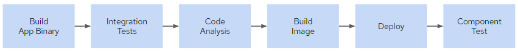

# Pipeline Definition as Code

<!-- TOC -->

- [Background](#background)
- [Pipeline from Git Repository](#pipeline-from-git-repository)

<!-- /TOC -->

In this lab you will get familiar with definine a pipeline as code and manage its versions via a version control system.

## Background
Although it is convenient to embed a Jenkinsfile into an OpenShift Pipeline and edit it directly in the OpenShift Web 
Console, there is no history of changes made to the pipeline through the UI. Furthermore, switching back and forth 
between multiple versions of the pipeline becomes challenging with an embedded Jenkinsfile. Therefore, it is generally 
considered a best practice to create a Jenkinsfile and check it into the source control repository in order to manage 
its versions and history of changes applied to it.

Using OpenShift Pipeline, you can store Jenkinsfiles in a Git repository and reference it in the JenkinsPipeline 
buildconfig. Whenever the pipeline starts running, OpenShift fetches the latest version the references Jenkinsfile 
from the Git repository and adjusts the pipeline steps accordingly. In this lab you will create an OpenShift Pipeline 
with the Jenkinsfile stored in a Git repository.

Although CI/CD is a fairly new in many organizations, teams have been building Continuous Integration flows for a 
long time and have invested lots of time improving and refining that process. For Java projects, the CI flow generally 
moves around building the application JAR/WAR/EAR, running the unit-tests suits and integration tests and if successful, 
releasing the application binaries into a repository manager like Sonatype Nexus and Artifactory. In this lab, you will 
modify the pipeline in order to extend existing CI processes and build upon the Maven build and test flow that exists 
in many development teams.

The following diagram shows the pipeline stages. For the sake simplicity, pushing the artifacts to an artifact 
repository is not included in this pipeline however you can include that using the Nexus Artifact Uploader Plugin for 
Sonatype Nexus and Artifactory Plugin for Artifactory.



## Pipeline from Git Repository
Let’s start with cloning the cart-service Git repository where you will store the Jenkinsfile:

```
Replace XX with the number provided to you by the instructor.
```
```bash
cd
git clone http://gogs-devops.apps.\<cluster url\>/userXX/cart-service.git
cd cart-service
touch Jenkinsfile
```

Open the created Jenkinsfile in a text editor and paste the following pipeline definition in the editor, and then save 
the Jenkinsfile:

```yaml
pipeline {
  agent {
    label 'maven'
  }
  stages {
    stage('Build App') {
      steps {
        sh "mvn clean package -s src/main/config/settings.xml -Dmaven.test.skip=true"
      }
    }
    stage('Integration Test') {
      steps {
        sh "mvn verify -s src/main/config/settings.xml"
      }
    }
    stage('Code Analysis') {
      steps {
        sh "mvn -s src/main/config/settings.xml sonar:sonar -Dsonar.host.url=http://sonarqube.devops.svc:9000 -Dmaven.test.skip=true"
      }
    }
    stage('Build Image') {
      steps {
        script {
          openshift.withCluster() {
            openshift.withProject('dev-XX') {
              openshift.startBuild("cart", "--from-file=target/cart.jar").logs("-f")
            }
          }
        }
      }
    }
    stage('Deploy') {
      steps {
        script {
          openshift.withCluster() {
            openshift.withProject('dev-XX') {
              dc = openshift.selector("dc", "cart")
              dc.rollout().latest()
              timeout(10) {
                  dc.rollout().status()
              }
            }
          }
        }
      }
    }
    stage('Component Test') {
      steps {
        script {
          sh "curl -s -X POST http://cart.dev-XX.svc:8080/api/cart/dummy/666/1"
          sh "curl -s http://cart.${env.DEV_PROJECT}.svc:8080/api/cart/dummy | grep 'Dummy Product'"
        }
      }
    }
  }
}
```

Notice that you don’t have to use Git to clone the code repository in the pipeline anymore. The reason for that is that 
Jenkins has to clone the given code repository for fetching the pipeline definition, Jenkinsfile, and if the code for 
the application is also in the same repository then there is no need to clone the code, again.

You need to push the Jenkinsfile to the Git repository in order to make it available on the Git server. Enter your Git 
username and password if asked:

- Username: \<userid - htpasswd userid/LDAP ID\>
- Password: \<password - htpasswd/LDAP password\>


You can now create an OpenShift Pipeline and refer the pipelines Git repository to pull the Jenkinsfile and execute it

```bash
oc new-app . --name=cart-pipeline-git --strategy=pipeline
oc env bc/cart-pipeline-git MAVEN_MIRROR_URL=http://nexus.devops.svc:8081/repository/maven-public/
```

Click on Builds on the left sidebar menu. A new Build Config of the cart-pipeline-git pipeline created. Start a new 
build if it has not been started.

[Previous](devops-simple-pipeline.md) | [Top](README.md) | [Next](devops-env-info.md)
