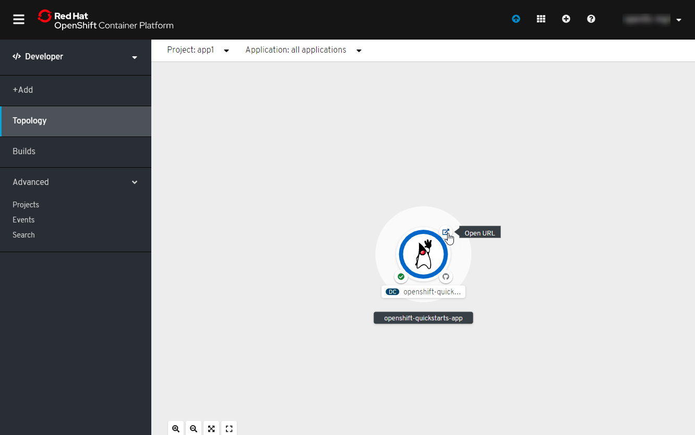

# Java S2I Build

<!-- TOC -->

- [Create Project](#create-project)
- [Create Application from Git](#create-application-from-git)
- [Create Application from Git](#create-application-from-git)
- [Start Build from Build Config](#start-build-from-build-config)
- [Launch Application](#launch-application)

<!-- /TOC -->

This guide is to showcase the Java s2i build on OpenShift. The source code repository is hosted on Gogs - 
openshift-quickstarts repository.

You will need to login to OpenShift console for this example.

## Create Project
After you login to the console, you can click Home > Projects from the menu.

Click Create Project button

Enter the Project name, display name, description as needed:

A new project will be created. Switch the console perspective to Developer view:

## Create Application from Git
Click +Add menu and click From Git

Enter the Git Repo URL:

[http://gogs-devops.apps.\<cluster url\>/gogsadmin/openshift-quickstarts](http://gogs-devops.apps.\<cluster url\>/gogsadmin/openshift-quickstarts) 

Enter the following: 
- Git Reference: master 
- Context Dir: /undertow-servlet

Select Java from the builder image.

- Builder Image Version: 8
- Application Name: <name of your choice>
- Name: <name of your choice>
- Create a route for applications: selected

Create Create button.

## Create Application from Git

After creation, you will be directed to Build Configs. You can also select from Builds menu.

Click Environment in the Build Config tab

Add a new variable:
- Name: MAVEN_MIRROR_URL
- Value: http://nexus.devops.svc:8081/repository/maven-public/

Click Save button

## Start Build from Build Config
From Build menu, click Start Build from the options of the Build Config created.

You can click the Build Config name to view the build logs.

You can check the logs to ensure there is no error, and the build is successfully completed.

## Launch Application
Click Topology menu to view the applications topology

Click the icon to launch the application.

[Previous](devops-codeready-workspaces.md) | [Top](README.md) | [Next](devops-deployment-envs.md)
